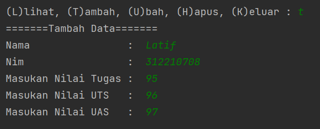
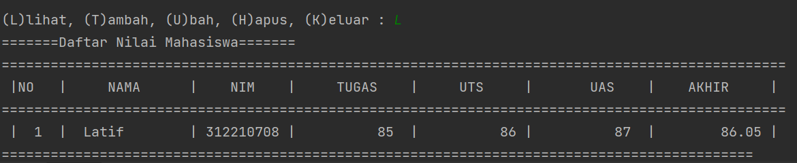
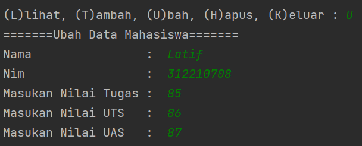
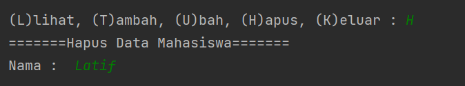
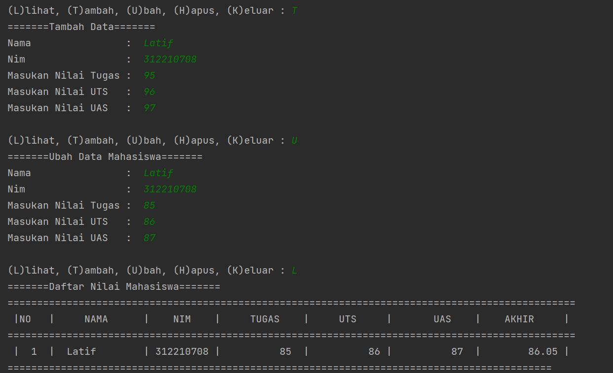
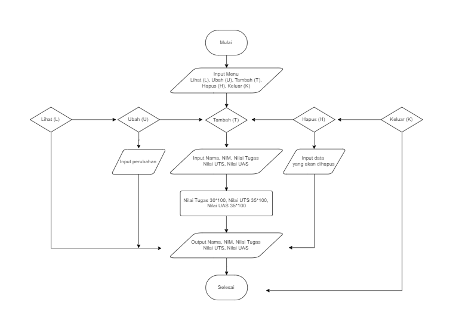

# Praktikum 6
## Program menampilkan daftar nilai mahasiswa

### Menu "Tambah"
Untuk menambahkan data yang akan diinputkan

``` python
def tambah():
        print("=======Tambah Data=======")
        nama    =input("Nama                :  ")
        nim     =input("Nim                 :  ")
        tugas   =int(input("Masukan Nilai Tugas :  "))
        uts     =int(input("Masukan Nilai UTS   :  "))
        uas     =int(input("Masukan Nilai UAS   :  "))
        akhir   = (0.30 * tugas) + (0.35 * uts) + (0.35 * uas)
        data[nama] = nim ,tugas, uts, uas, akhir
```
Output



### Menu "Lihat"
Untuk menampilkan data yang sudah diinput

``` python
    if data.items():
        print("=======Daftar Nilai Mahasiswa=======")
        print("================================================================================================")
        print(" |NO   |     NAMA      |    NIM    |     TUGAS    |     UTS     |       UAS    |    AKHIR     | ")
        print("================================================================================================")
        i=0
        for x in data.items():
            i+=1
            print(" | {6:2}  |  {0:12s} | {1:9s} | {2:11}  | {3:11} | {4:11}  |  {5:11} |"
                  .format(x[0], x[1][0], x[1][1], x[1][2], x[1][3], x[1][4], i))
            print("============================================================================================")
    else:
        print("=======Daftar Nilai Mahasiswa======")
        print("================================================================================================")
        print(" |NO   |     NAMA      |    NIM    |     TUGAS    |     UTS     |       UAS    |    AKHIR     | ")
        print("================================================================================================")
        print("|                                      TIDAK ADA DATA                                         |")
        print("===============================================================================================")
```
Output



### Menu "Ubah"
Untuk mengubah data yang sudah diinput

``` python
def ubah():
        print('=======Ubah Data Mahasiswa=======')
        nama = input('Nama                :  ')
        if nama in data.keys():
            nim     =input('Nim                 :  ')
            tugas   =int(input("Masukan Nilai Tugas :  "))
            uts     =int(input("Masukan Nilai UTS   :  "))
            uas     =int(input("Masukan Nilai UAS   :  "))
            akhir   =(0.30 * tugas) + (0.35 * uts) + (0.35 * uas)
            data[nama] = nim, tugas, uts, uas, akhir
        else:
            print("Data Nilai Tidak Ada".format(nama))
```
Output



### Menu "Hapus"
Untuk menghapus data yang sudah diinputkan

``` python
def hapus():
        print("=======Hapus Data Mahasiswa=======")
        nama=input("Nama :  ")
        if nama in data.keys():
            del data[nama]
        else:
            print("Data Nilai Tidak Ada".format(nama))
```
Output



## Run program



## Flowchart

